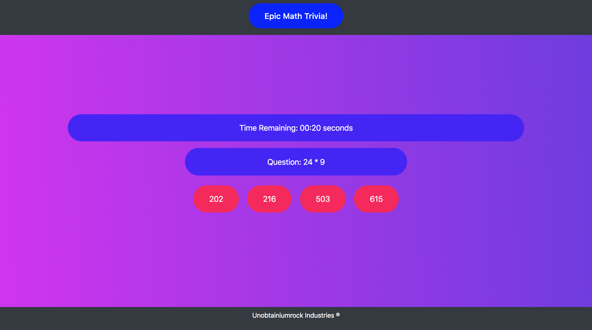

# Epic Math Trivia Game

This is a math trivia game. Five questions with four answer choices are randomly generated on each round. There is a 20 second time limit to answer each question before the answer is revealed. At the end of the game, your score of correct, incorrect, and unanswered questions will be displayed. You will then be given the option to try again if you'd like.

## Getting Started
Click the image or link to go to the game.

Hosted on [GitHub pages](https://unobtainiumrock.github.io/unit-4-game-without-hw-materials-/).

## Built With

* [Bootstrap](https://getbootstrap.com/docs/4.0/getting-started/introduction/)
* [JQuery](http://jquery.com/)
* [Javascript](https://eloquentjavascript.net/)
* [CSS](https://css-tricks.com/)

## Authors

* **Unobtainiumrock**

## License

This project is licensed under the MIT License - see the [LICENSE.md](LICENSE.md) file for details

## Acknowledgments

* Pineapple goes well on pizza
* Cats
* Trees
* Unobtainiumrock Industries ®

